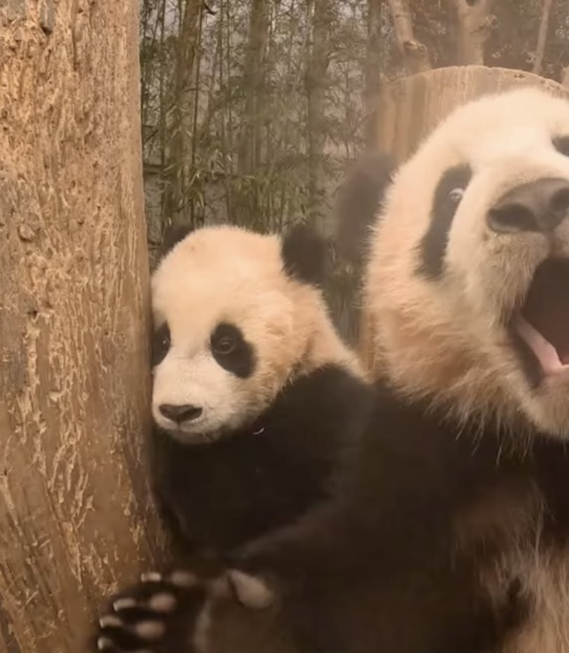

## Ello, I'm Sebin 🐼

### 🏫 4th Year Software Engineering Student
I’m currently in my last semester, and I’m excited to explore new opportunities in the field of software maintenance and evolution!

### 💻 Expectations for Software Maintenance and Evolution
- To gain a deeper understanding of maintaining and evolving software systems over time.
- To learn practical techniques for handling codebases, refactoring, and managing technical debt.
- To familiarize myself with industry-standard practices and tools for sustainable software development and long-term stability.

### 🌷 Fun Fact
- I have just been to the Day6 concert and I'm still living in that moment.
- 🐻🦊🐰🐶

### 🌟 Image that Represents Me
  

- I'm both of them. 
- ㅇㅅㅇ 
- ㅇㅁㅇ

### 🔗 My Customized GitHub Profile
- [GitHub Profile](https://github.com/ssebin)
